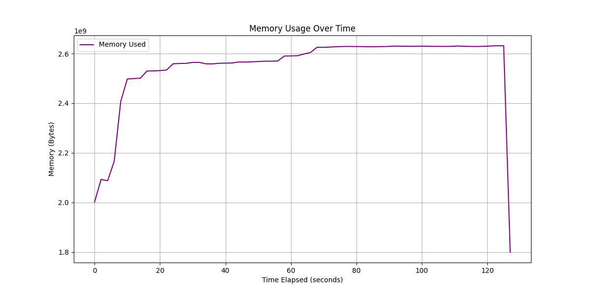

# DaseBigDataLab
## 实验目的

利用经典的词频统计任务对比Spark和MapReduce的迭代性能

## 实验设计

任务: 词频统计

数据集

1. 500MB 约270万条数据
2. 2.1G 约1100万行数据
3. 8.6G 约4500万行数据

执行时间收集:

每个规模的数据集执行三次词频统计任务，取平均值作为最终执行时间

资源使用情况:

利用Linux系统上的glances工具监控任务执行时间段内的资源使用情况

## 实验环境

## Spark和MapReduce资源配置

| 资源类型 | Spark | MapReduce |
|---------|--------|------------|
| CPU核心数 | 2 | 2 |
| 单任务内存 | 1g | 1024MB |
| 总内存 | 2g | 2g |
| 任务数量 | 2 | Map: 由输入决定<br>Reduce: 2 (可并行) |

Spark启动命令
```sql
/usr/local/spark/bin/spark-submit \
  --master spark://10.24.1.114:7077 \
  --driver-memory 1g \
  --executor-memory 1g \
  --total-executor-cores 2 \
  /home/dase-dis/wst_test/spark_cnt.py \
  /user/dase-dis/ch_input_2.txt \
  /user/dase-dis/ch_input_2_output
```

MapReduce启动命令
```sql
hadoop jar $HADOOP_HOME/share/hadoop/tools/lib/hadoop-streaming-3.3.6.jar \
  -files /home/dase-dis/wst_test/mapreduce_cnt.py \
  -mapper "python3 mapreduce_cnt.py mapper" \
  -reducer "python3 mapreduce_cnt.py reducer" \
  -input /user/dase-dis/ch_input_1.txt \
  -output /user/dase-dis/ch_input_1_output_mr \
  -numReduceTasks 2 \
  -D mapreduce.map.memory.mb=1024 \
  -D mapreduce.reduce.memory.mb=1024 \
  -D mapreduce.map.cpu.vcores=1 \
  -D mapreduce.reduce.cpu.vcores=1 \
  -D mapreduce.job.reduces=2
```
## 执行时间

### spark

#### Input1

```JavaScript
Iteration 1 execution time: 43.55 seconds
Iteration 2 execution time: 43.54 seconds
Iteration 3 execution time: 43.11 seconds
Average execution time for ch_input_1: 43.40 seconds
```

#### Input2

```JavaScript
Iteration 1 execution time: 128.06 seconds
Iteration 2 execution time: 127.08 seconds
Iteration 3 execution time: 127.56 seconds
Average execution time for ch_input_2: 127.57 seconds
```

#### Input3

```JavaScript
Iteration 1 execution time: 459.98 seconds
Iteration 2 execution time: 464.54 seconds
Iteration 3 execution time: 458.04 seconds
Average execution time for ch_input_3: 460.86 seconds
```

### MapReduce

#### Input1

```
Round 1: 89.43 seconds
Round 2: 90.36 seconds
Round 3: 88.43 seconds
Average execution time: 89.41 seconds
```

#### Input2

```
Round 1: 212.39 seconds
Round 2: 212.85 seconds
Round 3: 216.09 seconds
Average execution time: 213.78 seconds
```

#### Input3

```
Round 1: 814.37 seconds
Round 2: 790.73 seconds
Round 3: 781.78 seconds
Average execution time: 795.63 seconds
```

## 资源使用情况

### Spark

#### Input1

CPU


内存


IO


#### Input2

CPU


内存



IO


#### Input3

CPU


内存


IO


## Spark其它信息
### Input1
#### Stages

### Input2
#### Stages

### Input3 
#### Stages


## MapReduce其它信息
### Input1
#### Counters
```sql
File System Counters
                FILE: Number of bytes read=1497508592
                FILE: Number of bytes written=2247856444
                FILE: Number of read operations=0
                FILE: Number of large read operations=0
                FILE: Number of write operations=0
                HDFS: Number of bytes read=542984223
                HDFS: Number of bytes written=1165523
                HDFS: Number of read operations=22
                HDFS: Number of large read operations=0
                HDFS: Number of write operations=4
                HDFS: Number of bytes read erasure-coded=0
        Job Counters
                Launched map tasks=4
                Launched reduce tasks=2
                Data-local map tasks=4
                Total time spent by all maps in occupied slots (ms)=168825
                Total time spent by all reduces in occupied slots (ms)=77049
                Total time spent by all map tasks (ms)=168825
                Total time spent by all reduce tasks (ms)=77049
                Total vcore-milliseconds taken by all map tasks=168825
                Total vcore-milliseconds taken by all reduce tasks=77049
                Total megabyte-milliseconds taken by all map tasks=172876800
                Total megabyte-milliseconds taken by all reduce tasks=78898176
        Map-Reduce Framework
                Map input records=3185523
                Map output records=74344236
                Map output bytes=600037566
                Map output materialized bytes=748726086
                Input split bytes=396
                Combine input records=0
                Combine output records=0
                Reduce input groups=98220
                Reduce shuffle bytes=748726086
                Reduce input records=74344236
                Reduce output records=98220
                Spilled Records=223032708
                Shuffled Maps =8
                Failed Shuffles=0
                Merged Map outputs=8
                GC time elapsed (ms)=1049
                CPU time spent (ms)=257170
                Physical memory (bytes) snapshot=3258068992
                Virtual memory (bytes) snapshot=15473967104
                Total committed heap usage (bytes)=3585605632
                Peak Map Physical memory (bytes)=565252096
                Peak Map Virtual memory (bytes)=2586099712
                Peak Reduce Physical memory (bytes)=881889280
                Peak Reduce Virtual memory (bytes)=2640756736
```
### Input2
#### Counters
```sql
File System Counters
                FILE: Number of bytes read=5997539211
                FILE: Number of bytes written=9001311531
                FILE: Number of read operations=0
                FILE: Number of large read operations=0
                FILE: Number of write operations=0
                HDFS: Number of bytes read=2173632700
                HDFS: Number of bytes written=2645071
                HDFS: Number of read operations=61
                HDFS: Number of large read operations=0
                HDFS: Number of write operations=4
                HDFS: Number of bytes read erasure-coded=0
        Job Counters
                Killed map tasks=1
                Launched map tasks=18
                Launched reduce tasks=2
                Data-local map tasks=18
                Total time spent by all maps in occupied slots (ms)=757290
                Total time spent by all reduces in occupied slots (ms)=310739
                Total time spent by all map tasks (ms)=757290
                Total time spent by all reduce tasks (ms)=310739
                Total vcore-milliseconds taken by all map tasks=757290
                Total vcore-milliseconds taken by all reduce tasks=310739
                Total megabyte-milliseconds taken by all map tasks=775464960
                Total megabyte-milliseconds taken by all reduce tasks=318196736
        Map-Reduce Framework
                Map input records=12655583
                Map output records=297501729
                Map output bytes=2403661917
                Map output materialized bytes=2998665579
                Input split bytes=1683
                Combine input records=0
                Combine output records=0
                Reduce input groups=216447
                Reduce shuffle bytes=2998665579
                Reduce input records=297501729
                Reduce output records=216447
                Spilled Records=892505187
                Shuffled Maps =34
                Failed Shuffles=0
                Merged Map outputs=34
                GC time elapsed (ms)=5262
                CPU time spent (ms)=1119610
                Physical memory (bytes) snapshot=9460424704
                Virtual memory (bytes) snapshot=49228472320
                Total committed heap usage (bytes)=10627317760
                Peak Map Physical memory (bytes)=936181760
                Peak Map Virtual memory (bytes)=2618523648
                Peak Reduce Physical memory (bytes)=996061184
                Peak Reduce Virtual memory (bytes)=2635075584
```
### Input3
#### Counters
```sql
File System Counters
                FILE: Number of bytes read=29166603167
                FILE: Number of bytes written=41179216635
                FILE: Number of read operations=0
                FILE: Number of large read operations=0
                FILE: Number of write operations=0
                HDFS: Number of bytes read=8694530503
                HDFS: Number of bytes written=2768967
                HDFS: Number of read operations=205
                HDFS: Number of large read operations=0
                HDFS: Number of write operations=4
                HDFS: Number of bytes read erasure-coded=0
        Job Counters
                Killed map tasks=1
                Launched map tasks=66
                Launched reduce tasks=2
                Data-local map tasks=66
                Total time spent by all maps in occupied slots (ms)=2822514
                Total time spent by all reduces in occupied slots (ms)=1507388
                Total time spent by all map tasks (ms)=2822514
                Total time spent by all reduce tasks (ms)=1507388
                Total vcore-milliseconds taken by all map tasks=2822514
                Total vcore-milliseconds taken by all reduce tasks=1507388
                Total megabyte-milliseconds taken by all map tasks=2890254336
                Total megabyte-milliseconds taken by all reduce tasks=1543565312
        Map-Reduce Framework
                Map input records=50622332
                Map output records=1190006916
                Map output bytes=9614647668
                Map output materialized bytes=11994662280
                Input split bytes=6435
                Combine input records=0
                Combine output records=0
                Reduce input groups=216447
                Reduce shuffle bytes=11994662280
                Reduce input records=1190006916
                Reduce output records=216447
                Spilled Records=4083510807
                Shuffled Maps =130
                Failed Shuffles=0
                Merged Map outputs=130
                GC time elapsed (ms)=17424
                CPU time spent (ms)=4875130
                Physical memory (bytes) snapshot=29858291712
                Virtual memory (bytes) snapshot=173454344192
                Total committed heap usage (bytes)=34882453504
                Peak Map Physical memory (bytes)=864497664
                Peak Map Virtual memory (bytes)=2621448192
                Peak Reduce Physical memory (bytes)=1002860544
                Peak Reduce Virtual memory (bytes)=2648436736
```